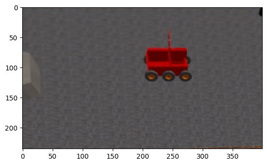

# Отслеживания передвежения робота с помощью opencv
1) Вручную раставить точки

2) Обрезать и трансформировать изображения

3) Выделить контуры с помощью threshold

4) Поставить точку в центр контура

