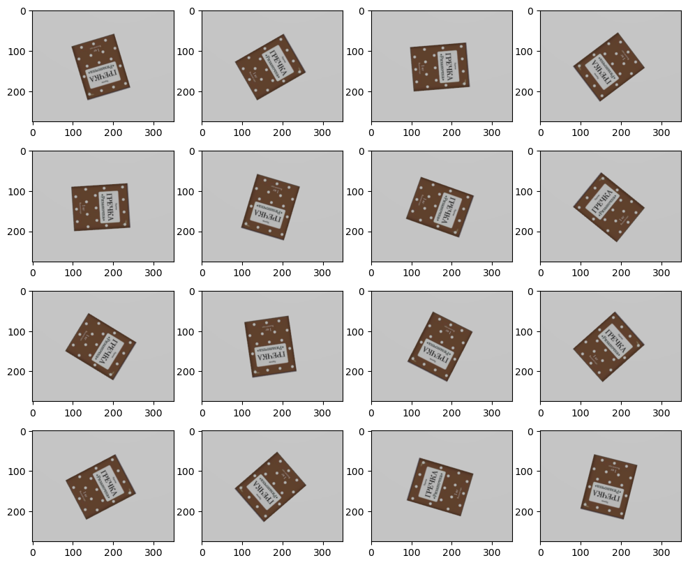
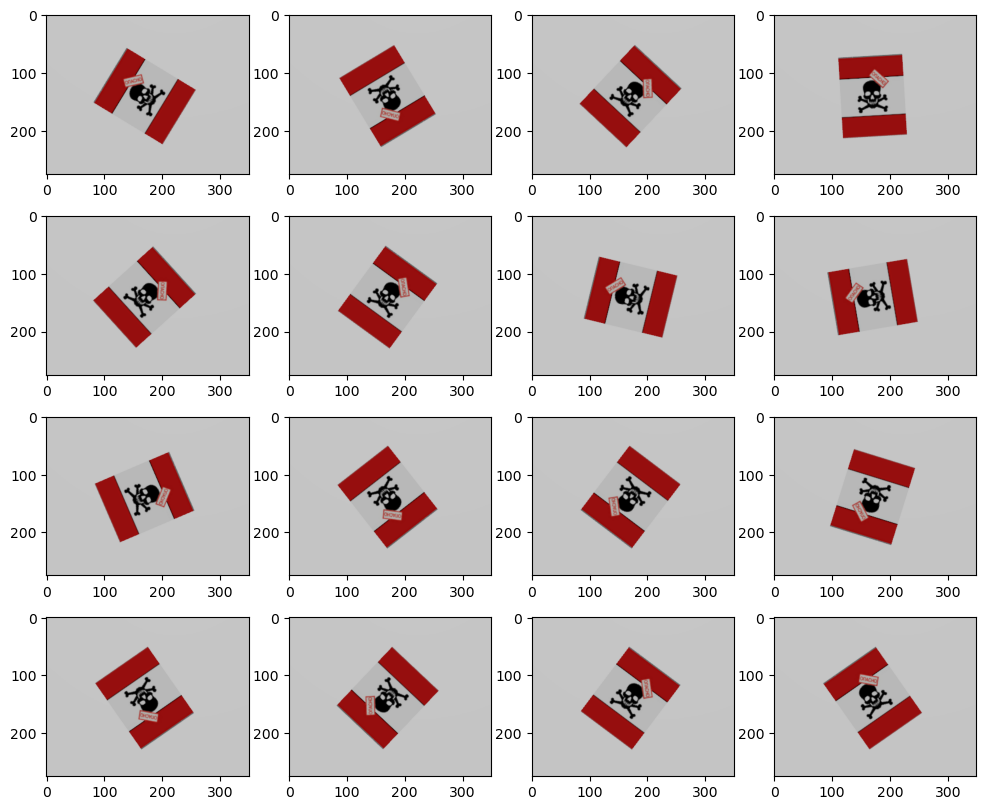
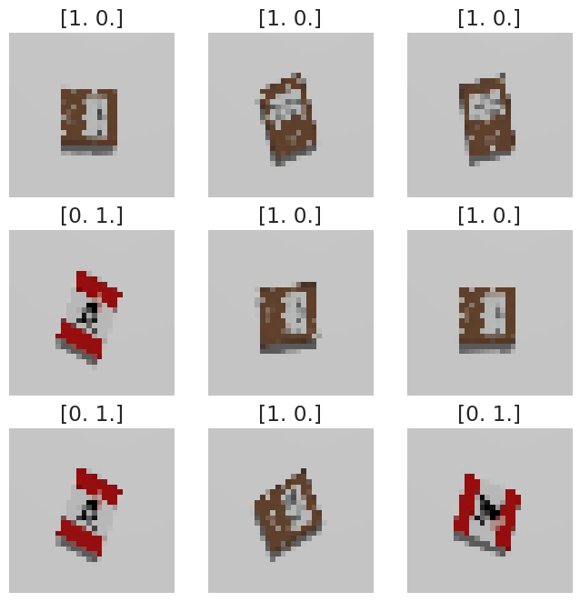
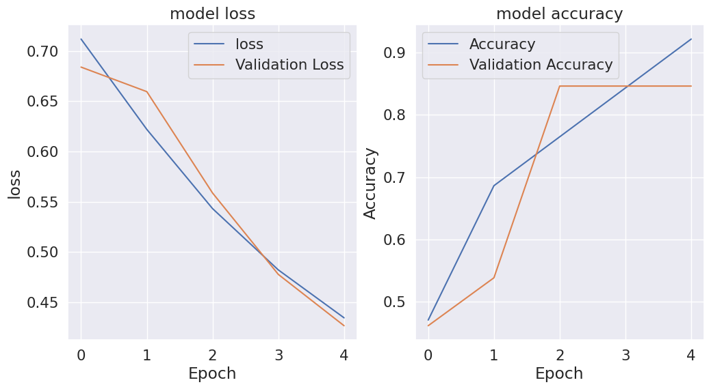
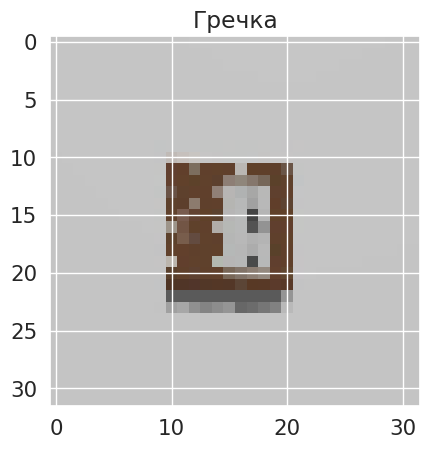

# Лабораторная работа 9
## Задание:
1. Создайте свой датасет для задачи бинарной классификации. В нем должно быть как можно больше изображений, содержащих объект (позитивные семплы), и не содержащих его (негативные семплы). Для увеличения количества данных используйте аугментацию. Используйте фотографии реально существующих объектов. Можете использовать уже существующий датасет. Структурируйте датасет, как это разбирали на одном из предыдущих занятий.
2. Используйте архитектуру сети VGGNet, представленную в работе. Не забудьте скорретировать формат тензора для входного слоя сети.
3. Визуализируйте архитектуру сети
4. При необходимости загрузите веса предобученной модели VGGNet, используя файл с весами h5. Это необходимо, если точность модели не увеличивается, или модель дает ошибку во время обучения.
5. Обучите модель сети на вашем датасете и определите точность классификации на тестовых данных.
6. Визуализируйте метрики точности при обучении сети
7. Проверьте прогностическую способность модели на одном семпле
8. Создайте confusion matrix для модели и проанализируйте результат.
## Подготовка окружения для генераций изображения


```python
# 1) Импорт всех необходимых библиотек
import cv2 as cv
import matplotlib.pyplot as plt
import numpy as np
from rich.table import Table
from gz_utils_balcon import EntityManager
import rclpy
from rclpy.wait_for_message import wait_for_message
from cv_bridge import CvBridge
from sensor_msgs.msg import Image
import time
import copy
import math
import threading
import random
#Rich
from rich.progress import track

# 2) Инциализация `rclpy` и создания node для наблюдения за сообщениями
if not rclpy.ok():
    rclpy.init()
    node = rclpy.create_node("simple_node")
    # thread = threading.Thread(target = rclpy.spin, args = (node,), daemon = True)
    # thread.start()


# 3) Создания CvBridge
bridge = CvBridge()

# 4) Создания экземпляра EntityManager для мира "default"
emg = EntityManager("default")


# 5) Функция для получения изображения
def get_msg():
    msg = wait_for_message(Image,node,"/camera/rgb/image_raw",time_to_wait=20000)
    if msg[0] == False:
        raise TimeoutError
    else:
        return msg


def get_image():
    msg = get_msg()
    img_rgb = bridge.imgmsg_to_cv2(msg[1])
    return img_rgb[100:375,150:500]

# 6) Функция для визуализаций ряда изображений
def vusial_imgs(ls_img):
    plt.figure(figsize=(12,10))
    for i in range(len(ls_img)):
        plt.subplot(4,4,i+1)
        plt.imshow(ls_img[i])

```

## Ход работы
### 1. Часть генерация изображения и сохранения их
Сгенерирум 16 изображений с случайным углом поворота для тренеровки и 8 изображений для тестов


```python
cereal_imgs_train = []

emg.delete_entity(["unknow"])
for i in range(16):
    yaw = random.random() * 2 * math.pi
    emg.create_entity("cereal.sdf", yaw = yaw)
    img1= get_image()
    emg.delete_entity(["unknow"])
    cereal_imgs_train.append(img1)
    time.sleep(0.1)

cereal_imgs_test = []
emg.delete_entity(["unknow"])
for i in range(8):
    yaw = random.random() * 2 * math.pi
    emg.create_entity("cereal.sdf", yaw = yaw)
    img1= get_image()
    emg.delete_entity(["unknow"])
    cereal_imgs_test.append(img1)
    time.sleep(0.1)

vusial_imgs(cereal_imgs_train)
```


    

    


```python
poison_imgs_train = []

emg.delete_entity(["unknow"])
for i in range(16):
    yaw = random.random() * 2 * math.pi
    emg.create_entity("poison.sdf", yaw = yaw)
    img1= get_image()
    emg.delete_entity(["unknow"])
    poison_imgs_train.append(img1)
    time.sleep(0.1)

poison_imgs_test = []
for i in range(8):
    yaw = random.random() * 2 * math.pi
    emg.create_entity("poison.sdf", yaw = yaw)
    img1= get_image()
    emg.delete_entity(["unknow"])
    poison_imgs_test.append(img1)
    time.sleep(0.1)
vusial_imgs(poison_imgs_train)
```


    

    


```python
for i in range(len(poison_imgs_train)):
    cv.imwrite(f"dataset/training/poison/img{i}.jpeg", poison_imgs[i])

for i in range(len(cereal_imgs_train)):
    cv.imwrite(f"dataset/training/cereal/img{i}.jpeg", cereal_imgs[i])

for i in range(len(poison_imgs_test)):
    cv.imwrite(f"dataset/val/poison/img{i}.jpeg", poison_imgs[i])

for i in range(len(cereal_imgs_test)):
    cv.imwrite(f"dataset/val/cereal/img{i}.jpeg", cereal_imgs[i])

```

### Часть 2 Исползования датасета и обучения модели


```python
!unzip dataset.zip
```


```python
import keras,os
from keras.models import Sequential
from keras.layers import Dense, Conv2D, MaxPool2D , Flatten
from tensorflow.keras.preprocessing.image import ImageDataGenerator
import numpy as np
import cv2
import matplotlib.pyplot as plt
import tensorflow as tf
import tensorflow_datasets as tfds
from tensorflow.keras import datasets, layers, models, losses
from tensorflow.keras.layers import Dense, Flatten, Dropout, BatchNormalization, Activation, MaxPooling2D,Conv2D, MaxPool2D,Input
import tensorflow as tf
from keras.utils import to_categorical
from keras import regularizers
from keras.models import Sequential, load_model
from keras.optimizers import Adam
```


```python
traindata = ImageDataGenerator()
testdata = ImageDataGenerator()

train_data = traindata.flow_from_directory("dataset/training", color_mode='rgb')
test_data = testdata.flow_from_directory("dataset/val", color_mode='rgb')

x_train, y_train = next(train_data)
x_test, y_test = next(test_data)
y_train = y_train[:,1:]
y_test = np.array(y_test[:,1:])

x_train = x_train.astype('float32')
x_test = x_test.astype('float32')

x_train  /= 255
x_test /= 255

def convert_bgr2rgb_and_resize(img):
  img = cv2.cvtColor(img,cv2.COLOR_BGR2RGB)
  img = cv2.resize(img,(32,32))
  return img

def transform(image):
    image =  image[:,::-1]
    return image


x_train = list(map(convert_bgr2rgb_and_resize, x_train))
x_test = list(map(convert_bgr2rgb_and_resize, x_test))
print(f"Размер исходного датасета: {len(x_train)}/{len(y_train)}")

x_train_transform = list(map(transform,x_train))
x_test = np.array(list(map(transform,x_test)))

x_train = np.concatenate((x_train, x_train_transform))
y_train = np.concatenate((y_train, y_train))

print(f"Размер нынешнего датасета: {len(x_train)}/{len(y_train)}")
```

    Found 32 images belonging to 3 classes.
    Found 16 images belonging to 3 classes.
    Размер исходного датасета: 32/32
    Размер нынешнего датасета: 64/64


```python
index_plot = 1
plt.figure(figsize=(8,8))
for i in range(9):
  img, label = x_train[i], y_train[i]
  z = label
  plt.subplot(3,3,index_plot)
  plt.axis('off')
  plt.title(label)
  plt.imshow(img)
  index_plot+=1
```


    

    


#### 2. Используйте архитектуру сети VGGNet, представленную в работе. Не забудьте скорретировать формат тензора для входного слоя сети.


```python
from tensorflow.keras.models import Sequential, Model

```


```python
from tensorflow.keras.applications.vgg16 import VGG16
vgg_model = VGG16(weights='imagenet', include_top=False, input_shape=(32,32,3))
vgg_model.summary()
```


<pre style="white-space:pre;overflow-x:auto;line-height:normal;font-family:Menlo,'DejaVu Sans Mono',consolas,'Courier New',monospace">
Model: "vgg16"
┏━━━━━━━━━━━━━━━━━━━━━━━━━━━━━━━━━━━━━━┳━━━━━━━━━━━━━━━━━━━━━━━━━━━━━┳━━━━━━━━━━━━━━━━━┓
┃<span style="font-weight: bold"> Layer (type)                         </span>┃<span style="font-weight: bold"> Output Shape                </span>┃<span style="font-weight: bold">         Param # </span>┃
┡━━━━━━━━━━━━━━━━━━━━━━━━━━━━━━━━━━━━━━╇━━━━━━━━━━━━━━━━━━━━━━━━━━━━━╇━━━━━━━━━━━━━━━━━┩
│ input_layer_35 (<span style="color: #0087ff; text-decoration-color: #0087ff">InputLayer</span>)          │ (<span style="color: #00d7ff; text-decoration-color: #00d7ff">None</span>, <span style="color: #00af00; text-decoration-color: #00af00">32</span>, <span style="color: #00af00; text-decoration-color: #00af00">32</span>, <span style="color: #00af00; text-decoration-color: #00af00">3</span>)           │               <span style="color: #00af00; text-decoration-color: #00af00">0</span> │
├──────────────────────────────────────┼─────────────────────────────┼─────────────────┤
│ block1_conv1 (<span style="color: #0087ff; text-decoration-color: #0087ff">Conv2D</span>)                │ (<span style="color: #00d7ff; text-decoration-color: #00d7ff">None</span>, <span style="color: #00af00; text-decoration-color: #00af00">32</span>, <span style="color: #00af00; text-decoration-color: #00af00">32</span>, <span style="color: #00af00; text-decoration-color: #00af00">64</span>)          │           <span style="color: #00af00; text-decoration-color: #00af00">1,792</span> │
├──────────────────────────────────────┼─────────────────────────────┼─────────────────┤
│ block1_conv2 (<span style="color: #0087ff; text-decoration-color: #0087ff">Conv2D</span>)                │ (<span style="color: #00d7ff; text-decoration-color: #00d7ff">None</span>, <span style="color: #00af00; text-decoration-color: #00af00">32</span>, <span style="color: #00af00; text-decoration-color: #00af00">32</span>, <span style="color: #00af00; text-decoration-color: #00af00">64</span>)          │          <span style="color: #00af00; text-decoration-color: #00af00">36,928</span> │
├──────────────────────────────────────┼─────────────────────────────┼─────────────────┤
│ block1_pool (<span style="color: #0087ff; text-decoration-color: #0087ff">MaxPooling2D</span>)           │ (<span style="color: #00d7ff; text-decoration-color: #00d7ff">None</span>, <span style="color: #00af00; text-decoration-color: #00af00">16</span>, <span style="color: #00af00; text-decoration-color: #00af00">16</span>, <span style="color: #00af00; text-decoration-color: #00af00">64</span>)          │               <span style="color: #00af00; text-decoration-color: #00af00">0</span> │
├──────────────────────────────────────┼─────────────────────────────┼─────────────────┤
│ block2_conv1 (<span style="color: #0087ff; text-decoration-color: #0087ff">Conv2D</span>)                │ (<span style="color: #00d7ff; text-decoration-color: #00d7ff">None</span>, <span style="color: #00af00; text-decoration-color: #00af00">16</span>, <span style="color: #00af00; text-decoration-color: #00af00">16</span>, <span style="color: #00af00; text-decoration-color: #00af00">128</span>)         │          <span style="color: #00af00; text-decoration-color: #00af00">73,856</span> │
├──────────────────────────────────────┼─────────────────────────────┼─────────────────┤
│ block2_conv2 (<span style="color: #0087ff; text-decoration-color: #0087ff">Conv2D</span>)                │ (<span style="color: #00d7ff; text-decoration-color: #00d7ff">None</span>, <span style="color: #00af00; text-decoration-color: #00af00">16</span>, <span style="color: #00af00; text-decoration-color: #00af00">16</span>, <span style="color: #00af00; text-decoration-color: #00af00">128</span>)         │         <span style="color: #00af00; text-decoration-color: #00af00">147,584</span> │
├──────────────────────────────────────┼─────────────────────────────┼─────────────────┤
│ block2_pool (<span style="color: #0087ff; text-decoration-color: #0087ff">MaxPooling2D</span>)           │ (<span style="color: #00d7ff; text-decoration-color: #00d7ff">None</span>, <span style="color: #00af00; text-decoration-color: #00af00">8</span>, <span style="color: #00af00; text-decoration-color: #00af00">8</span>, <span style="color: #00af00; text-decoration-color: #00af00">128</span>)           │               <span style="color: #00af00; text-decoration-color: #00af00">0</span> │
├──────────────────────────────────────┼─────────────────────────────┼─────────────────┤
│ block3_conv1 (<span style="color: #0087ff; text-decoration-color: #0087ff">Conv2D</span>)                │ (<span style="color: #00d7ff; text-decoration-color: #00d7ff">None</span>, <span style="color: #00af00; text-decoration-color: #00af00">8</span>, <span style="color: #00af00; text-decoration-color: #00af00">8</span>, <span style="color: #00af00; text-decoration-color: #00af00">256</span>)           │         <span style="color: #00af00; text-decoration-color: #00af00">295,168</span> │
├──────────────────────────────────────┼─────────────────────────────┼─────────────────┤
│ block3_conv2 (<span style="color: #0087ff; text-decoration-color: #0087ff">Conv2D</span>)                │ (<span style="color: #00d7ff; text-decoration-color: #00d7ff">None</span>, <span style="color: #00af00; text-decoration-color: #00af00">8</span>, <span style="color: #00af00; text-decoration-color: #00af00">8</span>, <span style="color: #00af00; text-decoration-color: #00af00">256</span>)           │         <span style="color: #00af00; text-decoration-color: #00af00">590,080</span> │
├──────────────────────────────────────┼─────────────────────────────┼─────────────────┤
│ block3_conv3 (<span style="color: #0087ff; text-decoration-color: #0087ff">Conv2D</span>)                │ (<span style="color: #00d7ff; text-decoration-color: #00d7ff">None</span>, <span style="color: #00af00; text-decoration-color: #00af00">8</span>, <span style="color: #00af00; text-decoration-color: #00af00">8</span>, <span style="color: #00af00; text-decoration-color: #00af00">256</span>)           │         <span style="color: #00af00; text-decoration-color: #00af00">590,080</span> │
├──────────────────────────────────────┼─────────────────────────────┼─────────────────┤
│ block3_pool (<span style="color: #0087ff; text-decoration-color: #0087ff">MaxPooling2D</span>)           │ (<span style="color: #00d7ff; text-decoration-color: #00d7ff">None</span>, <span style="color: #00af00; text-decoration-color: #00af00">4</span>, <span style="color: #00af00; text-decoration-color: #00af00">4</span>, <span style="color: #00af00; text-decoration-color: #00af00">256</span>)           │               <span style="color: #00af00; text-decoration-color: #00af00">0</span> │
├──────────────────────────────────────┼─────────────────────────────┼─────────────────┤
│ block4_conv1 (<span style="color: #0087ff; text-decoration-color: #0087ff">Conv2D</span>)                │ (<span style="color: #00d7ff; text-decoration-color: #00d7ff">None</span>, <span style="color: #00af00; text-decoration-color: #00af00">4</span>, <span style="color: #00af00; text-decoration-color: #00af00">4</span>, <span style="color: #00af00; text-decoration-color: #00af00">512</span>)           │       <span style="color: #00af00; text-decoration-color: #00af00">1,180,160</span> │
├──────────────────────────────────────┼─────────────────────────────┼─────────────────┤
│ block4_conv2 (<span style="color: #0087ff; text-decoration-color: #0087ff">Conv2D</span>)                │ (<span style="color: #00d7ff; text-decoration-color: #00d7ff">None</span>, <span style="color: #00af00; text-decoration-color: #00af00">4</span>, <span style="color: #00af00; text-decoration-color: #00af00">4</span>, <span style="color: #00af00; text-decoration-color: #00af00">512</span>)           │       <span style="color: #00af00; text-decoration-color: #00af00">2,359,808</span> │
├──────────────────────────────────────┼─────────────────────────────┼─────────────────┤
│ block4_conv3 (<span style="color: #0087ff; text-decoration-color: #0087ff">Conv2D</span>)                │ (<span style="color: #00d7ff; text-decoration-color: #00d7ff">None</span>, <span style="color: #00af00; text-decoration-color: #00af00">4</span>, <span style="color: #00af00; text-decoration-color: #00af00">4</span>, <span style="color: #00af00; text-decoration-color: #00af00">512</span>)           │       <span style="color: #00af00; text-decoration-color: #00af00">2,359,808</span> │
├──────────────────────────────────────┼─────────────────────────────┼─────────────────┤
│ block4_pool (<span style="color: #0087ff; text-decoration-color: #0087ff">MaxPooling2D</span>)           │ (<span style="color: #00d7ff; text-decoration-color: #00d7ff">None</span>, <span style="color: #00af00; text-decoration-color: #00af00">2</span>, <span style="color: #00af00; text-decoration-color: #00af00">2</span>, <span style="color: #00af00; text-decoration-color: #00af00">512</span>)           │               <span style="color: #00af00; text-decoration-color: #00af00">0</span> │
├──────────────────────────────────────┼─────────────────────────────┼─────────────────┤
│ block5_conv1 (<span style="color: #0087ff; text-decoration-color: #0087ff">Conv2D</span>)                │ (<span style="color: #00d7ff; text-decoration-color: #00d7ff">None</span>, <span style="color: #00af00; text-decoration-color: #00af00">2</span>, <span style="color: #00af00; text-decoration-color: #00af00">2</span>, <span style="color: #00af00; text-decoration-color: #00af00">512</span>)           │       <span style="color: #00af00; text-decoration-color: #00af00">2,359,808</span> │
├──────────────────────────────────────┼─────────────────────────────┼─────────────────┤
│ block5_conv2 (<span style="color: #0087ff; text-decoration-color: #0087ff">Conv2D</span>)                │ (<span style="color: #00d7ff; text-decoration-color: #00d7ff">None</span>, <span style="color: #00af00; text-decoration-color: #00af00">2</span>, <span style="color: #00af00; text-decoration-color: #00af00">2</span>, <span style="color: #00af00; text-decoration-color: #00af00">512</span>)           │       <span style="color: #00af00; text-decoration-color: #00af00">2,359,808</span> │
├──────────────────────────────────────┼─────────────────────────────┼─────────────────┤
│ block5_conv3 (<span style="color: #0087ff; text-decoration-color: #0087ff">Conv2D</span>)                │ (<span style="color: #00d7ff; text-decoration-color: #00d7ff">None</span>, <span style="color: #00af00; text-decoration-color: #00af00">2</span>, <span style="color: #00af00; text-decoration-color: #00af00">2</span>, <span style="color: #00af00; text-decoration-color: #00af00">512</span>)           │       <span style="color: #00af00; text-decoration-color: #00af00">2,359,808</span> │
├──────────────────────────────────────┼─────────────────────────────┼─────────────────┤
│ block5_pool (<span style="color: #0087ff; text-decoration-color: #0087ff">MaxPooling2D</span>)           │ (<span style="color: #00d7ff; text-decoration-color: #00d7ff">None</span>, <span style="color: #00af00; text-decoration-color: #00af00">1</span>, <span style="color: #00af00; text-decoration-color: #00af00">1</span>, <span style="color: #00af00; text-decoration-color: #00af00">512</span>)           │               <span style="color: #00af00; text-decoration-color: #00af00">0</span> │
└──────────────────────────────────────┴─────────────────────────────┴─────────────────┘
</pre>


```python
x = vgg_model.get_layer('block1_conv1').output
x = vgg_model.get_layer('block1_conv2') (x)
x = vgg_model.get_layer('block1_pool') (x)

x = vgg_model.get_layer('block2_conv1') (x)
x = vgg_model.get_layer('block2_conv2') (x)
x = vgg_model.get_layer('block2_pool') (x)

x = vgg_model.get_layer('block3_conv1') (x)
x = vgg_model.get_layer('block3_conv2') (x)
x = vgg_model.get_layer('block3_conv3') (x)
x = vgg_model.get_layer('block3_pool') (x)

x = vgg_model.get_layer('block4_conv1') (x)
x = vgg_model.get_layer('block4_conv2') (x)
x = vgg_model.get_layer('block4_conv3') (x)
x = vgg_model.get_layer('block4_pool') (x)

x = vgg_model.get_layer('block5_conv1') (x)
x = vgg_model.get_layer('block5_conv2') (x)
x = vgg_model.get_layer('block5_conv3') (x)
x = vgg_model.get_layer('block5_pool') (x)

x = Conv2D(64, 3, activation = 'relu', padding = 'same') (x)
x = Flatten() (x)
x = Dropout(0.5) (x)
x = Dense(2, activation="softmax") (x)
model = Model(inputs = vgg_model.input, outputs = x)

for layer in model.layers[:19]:
  layer.trainable = False
for layer in model.layers:
  print(layer.name, layer.trainable)
```

    input_layer_35 False
    block1_conv1 False
    block1_conv2 False
    block1_pool False
    block2_conv1 False
    block2_conv2 False
    block2_pool False
    block3_conv1 False
    block3_conv2 False
    block3_conv3 False
    block3_pool False
    block4_conv1 False
    block4_conv2 False
    block4_conv3 False
    block4_pool False
    block5_conv1 False
    block5_conv2 False
    block5_conv3 False
    block5_pool False
    conv2d_193 True
    flatten_33 True
    dropout_136 True
    dense_63 True


```python

model.compile(optimizer="adam", loss=keras.losses.categorical_crossentropy, metrics=['accuracy'])

```

#### 3. Визуализируйте архитектуру сети


```python
model.summary()

```


<pre style="white-space:pre;overflow-x:auto;line-height:normal;font-family:Menlo,'DejaVu Sans Mono',consolas,'Courier New',monospace"><span style="font-weight: bold">Model: "functional_892"</span>
</pre>


<pre style="white-space:pre;overflow-x:auto;line-height:normal;font-family:Menlo,'DejaVu Sans Mono',consolas,'Courier New',monospace">┏━━━━━━━━━━━━━━━━━━━━━━━━━━━━━━━━━━━━━━┳━━━━━━━━━━━━━━━━━━━━━━━━━━━━━┳━━━━━━━━━━━━━━━━━┓
┃<span style="font-weight: bold"> Layer (type)                         </span>┃<span style="font-weight: bold"> Output Shape                </span>┃<span style="font-weight: bold">         Param # </span>┃
┡━━━━━━━━━━━━━━━━━━━━━━━━━━━━━━━━━━━━━━╇━━━━━━━━━━━━━━━━━━━━━━━━━━━━━╇━━━━━━━━━━━━━━━━━┩
│ input_layer_35 (<span style="color: #0087ff; text-decoration-color: #0087ff">InputLayer</span>)          │ (<span style="color: #00d7ff; text-decoration-color: #00d7ff">None</span>, <span style="color: #00af00; text-decoration-color: #00af00">32</span>, <span style="color: #00af00; text-decoration-color: #00af00">32</span>, <span style="color: #00af00; text-decoration-color: #00af00">3</span>)           │               <span style="color: #00af00; text-decoration-color: #00af00">0</span> │
├──────────────────────────────────────┼─────────────────────────────┼─────────────────┤
│ block1_conv1 (<span style="color: #0087ff; text-decoration-color: #0087ff">Conv2D</span>)                │ (<span style="color: #00d7ff; text-decoration-color: #00d7ff">None</span>, <span style="color: #00af00; text-decoration-color: #00af00">32</span>, <span style="color: #00af00; text-decoration-color: #00af00">32</span>, <span style="color: #00af00; text-decoration-color: #00af00">64</span>)          │           <span style="color: #00af00; text-decoration-color: #00af00">1,792</span> │
├──────────────────────────────────────┼─────────────────────────────┼─────────────────┤
│ block1_conv2 (<span style="color: #0087ff; text-decoration-color: #0087ff">Conv2D</span>)                │ (<span style="color: #00d7ff; text-decoration-color: #00d7ff">None</span>, <span style="color: #00af00; text-decoration-color: #00af00">32</span>, <span style="color: #00af00; text-decoration-color: #00af00">32</span>, <span style="color: #00af00; text-decoration-color: #00af00">64</span>)          │          <span style="color: #00af00; text-decoration-color: #00af00">36,928</span> │
├──────────────────────────────────────┼─────────────────────────────┼─────────────────┤
│ block1_pool (<span style="color: #0087ff; text-decoration-color: #0087ff">MaxPooling2D</span>)           │ (<span style="color: #00d7ff; text-decoration-color: #00d7ff">None</span>, <span style="color: #00af00; text-decoration-color: #00af00">16</span>, <span style="color: #00af00; text-decoration-color: #00af00">16</span>, <span style="color: #00af00; text-decoration-color: #00af00">64</span>)          │               <span style="color: #00af00; text-decoration-color: #00af00">0</span> │
├──────────────────────────────────────┼─────────────────────────────┼─────────────────┤
│ block2_conv1 (<span style="color: #0087ff; text-decoration-color: #0087ff">Conv2D</span>)                │ (<span style="color: #00d7ff; text-decoration-color: #00d7ff">None</span>, <span style="color: #00af00; text-decoration-color: #00af00">16</span>, <span style="color: #00af00; text-decoration-color: #00af00">16</span>, <span style="color: #00af00; text-decoration-color: #00af00">128</span>)         │          <span style="color: #00af00; text-decoration-color: #00af00">73,856</span> │
├──────────────────────────────────────┼─────────────────────────────┼─────────────────┤
│ block2_conv2 (<span style="color: #0087ff; text-decoration-color: #0087ff">Conv2D</span>)                │ (<span style="color: #00d7ff; text-decoration-color: #00d7ff">None</span>, <span style="color: #00af00; text-decoration-color: #00af00">16</span>, <span style="color: #00af00; text-decoration-color: #00af00">16</span>, <span style="color: #00af00; text-decoration-color: #00af00">128</span>)         │         <span style="color: #00af00; text-decoration-color: #00af00">147,584</span> │
├──────────────────────────────────────┼─────────────────────────────┼─────────────────┤
│ block2_pool (<span style="color: #0087ff; text-decoration-color: #0087ff">MaxPooling2D</span>)           │ (<span style="color: #00d7ff; text-decoration-color: #00d7ff">None</span>, <span style="color: #00af00; text-decoration-color: #00af00">8</span>, <span style="color: #00af00; text-decoration-color: #00af00">8</span>, <span style="color: #00af00; text-decoration-color: #00af00">128</span>)           │               <span style="color: #00af00; text-decoration-color: #00af00">0</span> │
├──────────────────────────────────────┼─────────────────────────────┼─────────────────┤
│ block3_conv1 (<span style="color: #0087ff; text-decoration-color: #0087ff">Conv2D</span>)                │ (<span style="color: #00d7ff; text-decoration-color: #00d7ff">None</span>, <span style="color: #00af00; text-decoration-color: #00af00">8</span>, <span style="color: #00af00; text-decoration-color: #00af00">8</span>, <span style="color: #00af00; text-decoration-color: #00af00">256</span>)           │         <span style="color: #00af00; text-decoration-color: #00af00">295,168</span> │
├──────────────────────────────────────┼─────────────────────────────┼─────────────────┤
│ block3_conv2 (<span style="color: #0087ff; text-decoration-color: #0087ff">Conv2D</span>)                │ (<span style="color: #00d7ff; text-decoration-color: #00d7ff">None</span>, <span style="color: #00af00; text-decoration-color: #00af00">8</span>, <span style="color: #00af00; text-decoration-color: #00af00">8</span>, <span style="color: #00af00; text-decoration-color: #00af00">256</span>)           │         <span style="color: #00af00; text-decoration-color: #00af00">590,080</span> │
├──────────────────────────────────────┼─────────────────────────────┼─────────────────┤
│ block3_conv3 (<span style="color: #0087ff; text-decoration-color: #0087ff">Conv2D</span>)                │ (<span style="color: #00d7ff; text-decoration-color: #00d7ff">None</span>, <span style="color: #00af00; text-decoration-color: #00af00">8</span>, <span style="color: #00af00; text-decoration-color: #00af00">8</span>, <span style="color: #00af00; text-decoration-color: #00af00">256</span>)           │         <span style="color: #00af00; text-decoration-color: #00af00">590,080</span> │
├──────────────────────────────────────┼─────────────────────────────┼─────────────────┤
│ block3_pool (<span style="color: #0087ff; text-decoration-color: #0087ff">MaxPooling2D</span>)           │ (<span style="color: #00d7ff; text-decoration-color: #00d7ff">None</span>, <span style="color: #00af00; text-decoration-color: #00af00">4</span>, <span style="color: #00af00; text-decoration-color: #00af00">4</span>, <span style="color: #00af00; text-decoration-color: #00af00">256</span>)           │               <span style="color: #00af00; text-decoration-color: #00af00">0</span> │
├──────────────────────────────────────┼─────────────────────────────┼─────────────────┤
│ block4_conv1 (<span style="color: #0087ff; text-decoration-color: #0087ff">Conv2D</span>)                │ (<span style="color: #00d7ff; text-decoration-color: #00d7ff">None</span>, <span style="color: #00af00; text-decoration-color: #00af00">4</span>, <span style="color: #00af00; text-decoration-color: #00af00">4</span>, <span style="color: #00af00; text-decoration-color: #00af00">512</span>)           │       <span style="color: #00af00; text-decoration-color: #00af00">1,180,160</span> │
├──────────────────────────────────────┼─────────────────────────────┼─────────────────┤
│ block4_conv2 (<span style="color: #0087ff; text-decoration-color: #0087ff">Conv2D</span>)                │ (<span style="color: #00d7ff; text-decoration-color: #00d7ff">None</span>, <span style="color: #00af00; text-decoration-color: #00af00">4</span>, <span style="color: #00af00; text-decoration-color: #00af00">4</span>, <span style="color: #00af00; text-decoration-color: #00af00">512</span>)           │       <span style="color: #00af00; text-decoration-color: #00af00">2,359,808</span> │
├──────────────────────────────────────┼─────────────────────────────┼─────────────────┤
│ block4_conv3 (<span style="color: #0087ff; text-decoration-color: #0087ff">Conv2D</span>)                │ (<span style="color: #00d7ff; text-decoration-color: #00d7ff">None</span>, <span style="color: #00af00; text-decoration-color: #00af00">4</span>, <span style="color: #00af00; text-decoration-color: #00af00">4</span>, <span style="color: #00af00; text-decoration-color: #00af00">512</span>)           │       <span style="color: #00af00; text-decoration-color: #00af00">2,359,808</span> │
├──────────────────────────────────────┼─────────────────────────────┼─────────────────┤
│ block4_pool (<span style="color: #0087ff; text-decoration-color: #0087ff">MaxPooling2D</span>)           │ (<span style="color: #00d7ff; text-decoration-color: #00d7ff">None</span>, <span style="color: #00af00; text-decoration-color: #00af00">2</span>, <span style="color: #00af00; text-decoration-color: #00af00">2</span>, <span style="color: #00af00; text-decoration-color: #00af00">512</span>)           │               <span style="color: #00af00; text-decoration-color: #00af00">0</span> │
├──────────────────────────────────────┼─────────────────────────────┼─────────────────┤
│ block5_conv1 (<span style="color: #0087ff; text-decoration-color: #0087ff">Conv2D</span>)                │ (<span style="color: #00d7ff; text-decoration-color: #00d7ff">None</span>, <span style="color: #00af00; text-decoration-color: #00af00">2</span>, <span style="color: #00af00; text-decoration-color: #00af00">2</span>, <span style="color: #00af00; text-decoration-color: #00af00">512</span>)           │       <span style="color: #00af00; text-decoration-color: #00af00">2,359,808</span> │
├──────────────────────────────────────┼─────────────────────────────┼─────────────────┤
│ block5_conv2 (<span style="color: #0087ff; text-decoration-color: #0087ff">Conv2D</span>)                │ (<span style="color: #00d7ff; text-decoration-color: #00d7ff">None</span>, <span style="color: #00af00; text-decoration-color: #00af00">2</span>, <span style="color: #00af00; text-decoration-color: #00af00">2</span>, <span style="color: #00af00; text-decoration-color: #00af00">512</span>)           │       <span style="color: #00af00; text-decoration-color: #00af00">2,359,808</span> │
├──────────────────────────────────────┼─────────────────────────────┼─────────────────┤
│ block5_conv3 (<span style="color: #0087ff; text-decoration-color: #0087ff">Conv2D</span>)                │ (<span style="color: #00d7ff; text-decoration-color: #00d7ff">None</span>, <span style="color: #00af00; text-decoration-color: #00af00">2</span>, <span style="color: #00af00; text-decoration-color: #00af00">2</span>, <span style="color: #00af00; text-decoration-color: #00af00">512</span>)           │       <span style="color: #00af00; text-decoration-color: #00af00">2,359,808</span> │
├──────────────────────────────────────┼─────────────────────────────┼─────────────────┤
│ block5_pool (<span style="color: #0087ff; text-decoration-color: #0087ff">MaxPooling2D</span>)           │ (<span style="color: #00d7ff; text-decoration-color: #00d7ff">None</span>, <span style="color: #00af00; text-decoration-color: #00af00">1</span>, <span style="color: #00af00; text-decoration-color: #00af00">1</span>, <span style="color: #00af00; text-decoration-color: #00af00">512</span>)           │               <span style="color: #00af00; text-decoration-color: #00af00">0</span> │
├──────────────────────────────────────┼─────────────────────────────┼─────────────────┤
│ conv2d_193 (<span style="color: #0087ff; text-decoration-color: #0087ff">Conv2D</span>)                  │ (<span style="color: #00d7ff; text-decoration-color: #00d7ff">None</span>, <span style="color: #00af00; text-decoration-color: #00af00">1</span>, <span style="color: #00af00; text-decoration-color: #00af00">1</span>, <span style="color: #00af00; text-decoration-color: #00af00">64</span>)            │         <span style="color: #00af00; text-decoration-color: #00af00">294,976</span> │
├──────────────────────────────────────┼─────────────────────────────┼─────────────────┤
│ flatten_33 (<span style="color: #0087ff; text-decoration-color: #0087ff">Flatten</span>)                 │ (<span style="color: #00d7ff; text-decoration-color: #00d7ff">None</span>, <span style="color: #00af00; text-decoration-color: #00af00">64</span>)                  │               <span style="color: #00af00; text-decoration-color: #00af00">0</span> │
├──────────────────────────────────────┼─────────────────────────────┼─────────────────┤
│ dropout_136 (<span style="color: #0087ff; text-decoration-color: #0087ff">Dropout</span>)                │ (<span style="color: #00d7ff; text-decoration-color: #00d7ff">None</span>, <span style="color: #00af00; text-decoration-color: #00af00">64</span>)                  │               <span style="color: #00af00; text-decoration-color: #00af00">0</span> │
├──────────────────────────────────────┼─────────────────────────────┼─────────────────┤
│ dense_63 (<span style="color: #0087ff; text-decoration-color: #0087ff">Dense</span>)                     │ (<span style="color: #00d7ff; text-decoration-color: #00d7ff">None</span>, <span style="color: #00af00; text-decoration-color: #00af00">2</span>)                   │             <span style="color: #00af00; text-decoration-color: #00af00">130</span> │
└──────────────────────────────────────┴─────────────────────────────┴─────────────────┘
</pre>


<pre style="white-space:pre;overflow-x:auto;line-height:normal;font-family:Menlo,'DejaVu Sans Mono',consolas,'Courier New',monospace"><span style="font-weight: bold"> Total params: </span><span style="color: #00af00; text-decoration-color: #00af00">15,009,794</span> (57.26 MB)
</pre>


<pre style="white-space:pre;overflow-x:auto;line-height:normal;font-family:Menlo,'DejaVu Sans Mono',consolas,'Courier New',monospace"><span style="font-weight: bold"> Trainable params: </span><span style="color: #00af00; text-decoration-color: #00af00">295,106</span> (1.13 MB)
</pre>


<pre style="white-space:pre;overflow-x:auto;line-height:normal;font-family:Menlo,'DejaVu Sans Mono',consolas,'Courier New',monospace"><span style="font-weight: bold"> Non-trainable params: </span><span style="color: #00af00; text-decoration-color: #00af00">14,714,688</span> (56.13 MB)
</pre>


#### 5. Обучите модель сети на вашем датасете и определите точность классификации на тестовых данных.


```python
# from keras.callbacks import ModelCheckpoint, EarlyStopping
# checkpoint = ModelCheckpoint("vgg16_1.h5", monitor='val_accuracy', verbose=1, save_best_only=True, save_weights_only=False, mode='auto', period=1)
# early = EarlyStopping(monitor='val_accuracy', patience=5, verbose=1, mode='auto')
history = model.fit(x_train, y_train, epochs=5, validation_split=0.2)
```

    Epoch 1/5
    2/2 ━━━━━━━━━━━━━━━━━━━━ 5s 2s/step - accuracy: 0.4700 - loss: 0.7181 - val_accuracy: 0.4615 - val_loss: 0.6839
    Epoch 2/5
    2/2 ━━━━━━━━━━━━━━━━━━━━ 1s 71ms/step - accuracy: 0.6971 - loss: 0.6184 - val_accuracy: 0.5385 - val_loss: 0.6595
    Epoch 3/5
    2/2 ━━━━━━━━━━━━━━━━━━━━ 0s 70ms/step - accuracy: 0.7598 - loss: 0.5355 - val_accuracy: 0.8462 - val_loss: 0.5586
    Epoch 4/5
    2/2 ━━━━━━━━━━━━━━━━━━━━ 0s 103ms/step - accuracy: 0.8433 - loss: 0.4839 - val_accuracy: 0.8462 - val_loss: 0.4777
    Epoch 5/5
    2/2 ━━━━━━━━━━━━━━━━━━━━ 0s 105ms/step - accuracy: 0.9269 - loss: 0.4379 - val_accuracy: 0.8462 - val_loss: 0.4266


#### 6. Визуализируйте метрики точности при обучении сети


```python
import matplotlib.pyplot as plt
plt.figure(figsize=(12,6))
plt.subplot(1,2,1)
plt.plot(history.history['loss'])
plt.plot(history.history['val_loss'])
plt.ylabel("loss")
plt.xlabel("Epoch")
plt.title("model loss")
plt.legend(["loss","Validation Loss"])

plt.subplot(1,2,2)
plt.title("model accuracy")

plt.plot(history.history["accuracy"])
plt.plot(history.history['val_accuracy'])

plt.ylabel("Accuracy")
plt.xlabel("Epoch")
plt.legend(["Accuracy","Validation Accuracy"])
```


    <matplotlib.legend.Legend at 0x7f6515179690>


    

    


```python
model.evaluate(x_test,y_test)
```

    1/1 ━━━━━━━━━━━━━━━━━━━━ 0s 414ms/step - accuracy: 0.9375 - loss: 0.4251


    [0.425065815448761, 0.9375]


#### 7. Проверьте прогностическую способность модели на одном семпле


```python
class_names =['Гречка','Яд']
```


```python
sample = x_train[0]
sample_index = np.argmax(y_train[0])
```


```python
plt.title(class_names[sample_index])
plt.imshow(sample)
```


    <matplotlib.image.AxesImage at 0x7f6674bcecd0>


    

    


```python
sample = np.expand_dims(sample, axis=0)
prediction = model.predict(sample)
print(class_names[np.argmax(prediction)])
```

    WARNING:tensorflow:6 out of the last 8 calls to <function TensorFlowTrainer.make_predict_function.<locals>.one_step_on_data_distributed at 0x7f6674bf7ba0> triggered tf.function retracing. Tracing is expensive and the excessive number of tracings could be due to (1) creating @tf.function repeatedly in a loop, (2) passing tensors with different shapes, (3) passing Python objects instead of tensors. For (1), please define your @tf.function outside of the loop. For (2), @tf.function has reduce_retracing=True option that can avoid unnecessary retracing. For (3), please refer to https://www.tensorflow.org/guide/function#controlling_retracing and https://www.tensorflow.org/api_docs/python/tf/function for  more details.


    1/1 ━━━━━━━━━━━━━━━━━━━━ 1s 1s/step
    Гречка


#### 8. Создайте confusion matrix для модели и проанализируйте результат."


```python
prediction = model.predict(x_train)
```

    2/2 ━━━━━━━━━━━━━━━━━━━━ 1s 20ms/step 


```python
import numpy as np
a  = np.array([[0,1,0,0],[1,0,0,0],[0,0,0,1]])
print('np.argmax(a, axis=1): {0}'.format(np.argmax(a, axis=1)))
```

    np.argmax(a, axis=1): [1 0 3]


```python
y_train_int = np.argmax(y_train, axis = 1)
prediction_int = np.argmax(prediction, axis = 1)
```


```python
import pandas as pd
import seaborn as sns
import matplotlib.pyplot as plt

from sklearn.metrics import confusion_matrix

label_names = [i for i in range(2)]
cmx = confusion_matrix(y_train_int, prediction_int, labels = label_names)
df_cm = pd.DataFrame(cmx)
sns.set(font_scale = 1.4)
sns.heatmap(df_cm,annot=True, annot_kws={"size":9},fmt="d")
plt.show()
```


    

    

